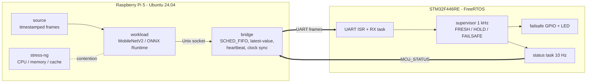
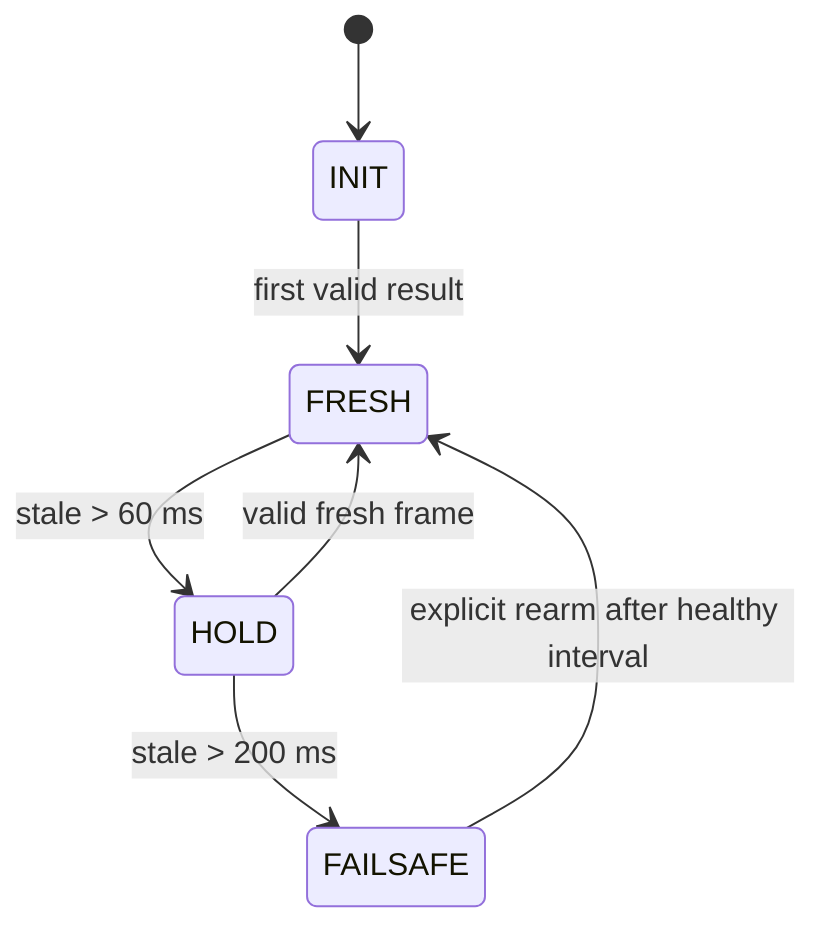

# Slide Overview: Heterogeneous Edge-AI OS (design after research pass R1-R8)

Status: design as of 2026-10-06 (`docs/SYSTEM_OVERVIEW.md` + `docs/research/DESIGN_CHANGES.md`).
**Nothing is MEASURED yet.** Every number below is a design value (ASSUMED), a calculation
(CALCULATED) or a published figure from someone else's setup (SOURCE). Slides must say so.

Part A is a slide-by-slide outline. Part B is the image prompts for ChatGPT.
Part C lists what not to claim.

---

## Part A. Slide outline (about 14 slides)

### 1. Title
- "Two operating systems, one deadline: supervising a Linux AI workload with a FreeRTOS microcontroller"
- Raspberry Pi 5 (Ubuntu 24.04) + STM32F446RE (FreeRTOS), linked by UART.
- Visual: hero image (prompt B1).

### 2. Motivation: the problem in one scenario
- The Pi reads a "sensor" frame periodically, runs a neural network, and sends the result
  (e.g. "obstacle / no obstacle") to a microcontroller that drives something physical.
- **Problem 1, late data:** under load, Linux shares the CPU fairly, results queue up, and the
  MCU acts on an old answer without knowing it is old.
- **Problem 2, silent failure:** if the process crashes or Linux freezes, the MCU keeps using the
  last answer forever. A watchdog on the Pi freezes together with Linux.
- Visual: prompt B2 (stale data) or a timeline sketch.

### 3. Key idea
- Split responsibility across two OSes:
  - **Linux (Pi 5):** heavy, variable work (inference, I/O).
  - **FreeRTOS (STM32):** strict supervisor with a stopwatch, independent of Linux.
- Analogy: smart but easily distracted worker + strict supervisor who does not rely on the
  worker to report its own failure.
- We write no new kernel. The "OS design" is how stock mechanisms are configured and combined.
- Visual: prompt B3 (worker/supervisor analogy).

### 4. Hardware architecture
- Raspberry Pi 5: 4x Cortex-A76 @ 2.4 GHz, 4 GB, Ubuntu Server 24.04 ARM64.
- STM32F446RE Nucleo: Cortex-M4F @ 180 MHz, 128 KB SRAM, FreeRTOS.
- Direct 3.3 V UART: Pi GPIO14/15 (pins 8/10) to STM32 USART1 (PA10/PA9), shared GND.
  USART2 stays on the ST-LINK debug console.
- Optional GPIO line + STM32 timer input capture to validate the clock alignment.
- Logic analyzer (optional) as an independent timing reference.
- Visual: prompt B4 (bench photo look), plus a clean wiring diagram drawn in the slide tool.

### 5. Software architecture (draw this yourself, see diagram D1 below)
- **Linux side:** `source` (timestamped frames) -> `workload` (MobileNetV2, ONNX Runtime CPU)
  -> Unix domain socket -> `bridge` (latest-value buffer, UART framing, heartbeat, clock sync).
  `stress-ng` stressors compete for CPU, memory and cache.
- **STM32 side:** UART RX interrupt -> stream buffer -> RX task (parser) -> supervisor task
  (1 kHz) -> failsafe GPIO/LED; status task sends MCU_STATUS back at 10 Hz.

### 6. Linux-side mechanisms (stock features only, no kernel patch)
| Mechanism | What it does here |
|---|---|
| `SCHED_FIFO` priority 50 | Bridge preempts bulk work |
| CPU affinity | Inference on CPU 0, bridge on CPU 1, stressors on CPUs 2-3 |
| cgroup v2 `cpu.max` | Caps workload and stressors |
| `mlockall` + preallocated buffers | No page faults on the critical path |
| Latest-value buffer | A new result overwrites an unsent old one (no growing queue) |
| RT throttling kept at 95% | Safety net if the FIFO task misbehaves |

### 7. Runtime profiles (same code, selected by config)
| Profile | Meaning | Compared against |
|---|---|---|
| P0 stock | All Linux defaults, FIFO queue | baseline |
| P1 tuned | FIFO + pinning + cgroups + mlockall | P0: effect of tuning |
| P2 tuned + latest-value | P1 + overwrite buffer | P1: effect of buffering only |
| P3 RT kernel | P1 on packaged Real-time Ubuntu kernel (PREEMPT_RT) | P1: effect of kernel only |
- Message: each comparison changes **one** thing.

### 8. STM32 supervisor (the core safety mechanism)
- Two separate timers: **heartbeat liveness** and **result freshness**. A live bridge can still
  forward stale results, so heartbeat alone is not enough (R1, Simplex architecture).
- States: FRESH -> HOLD (stop trusting new Pi decisions) -> FAILSAFE (safe output).
  Design values: heartbeat every 20 ms; HOLD after 60 ms; FAILSAFE after 200 ms (ASSUMED,
  to be tuned from measured inference latency).
- FAILSAFE is **latched**: leaving it needs an explicit rearm after a healthy interval.
- Duplicates, old sequence numbers and corrupted frames never refresh a timer.
- Visual: state machine diagram D2 (draw it yourself).

### 9. UART protocol v1
- Frame: SOF `A5 5A` | version | type | seq | len | payload (0-64 B) | CRC-16/CCITT. 9-byte overhead.
- Messages: HEARTBEAT, INFERENCE (input/done timestamps, seq, class, confidence),
  ECHO_REQ / ECHO_RESP (clock sync), MCU_STATUS.
- CALCULATED: a 31-byte inference frame takes about 2.7 ms at 115200 baud, 0.34 ms at 921600.
- Host-tested: 19998/20000 frames recovered with random noise between frames, zero false accepts.
  (Host test only, not yet on a real UART.)

### 10. Time: two clocks, one timeline
- Pi `CLOCK_MONOTONIC_RAW` (ns) and the STM32 timer (us) are separate clock domains.
  We never subtract across them without a mapping.
- NTP-style four-timestamp exchange over UART: T1 (Pi send), T2 (MCU receive),
  T3 (MCU send), T4 (Pi receive) -> offset and drift.
- A GPIO edge captured by an STM32 timer checks the result independently.
- Target: sub-millisecond alignment (to be measured, R8).
- Visual: diagram D3 (four-timestamp exchange).

### 11. Metric: Age of Information (AoI)
- AoI at time t = t minus the capture time of the newest result the MCU has.
  It grows linearly and drops when a fresh result arrives (sawtooth).
- Reported: time-average AoI, peak AoI (P95/P99/max), age-violation fraction V(tau),
  per-input deadline-miss fraction with explicit denominators (R2).
- Why not just latency: a system can deliver each message "fast" and still act on old data
  if messages queue up.
- Visual: sawtooth plot D4 (draw it from a formula, not with an image generator).

### 12. Experiments E1-E4 and hypotheses
| ID | Question | Compare | Main metric | Hypothesis |
|---|---|---|---|---|
| E1 | How much does contention hurt? | P0 idle vs each stressor | latency P50/P95/P99 | H1: P99 grows much more than P50 |
| E2 | How much does tuning / RT kernel recover? | P0 vs P1, P1 vs P3 | same + dispatch jitter | H2: P1 fixes CPU contention, not memory/cache contention |
| E3 | Does latest-value keep data fresh? | P1 vs P2, rising load | AoI metrics | H3: P2 lowers average AoI and violations; no hard bound |
| E4 | Is failsafe reaction bounded? | kill bridge, SIGSTOP, FIFO CPU hog | t_d - t_f, t_s - t_d, t_s - t_f on one logic-analyzer clock | H4: within timeout + one supervisor tick for every fault |
- Stressors (E1): `stress-ng --stream`, `--cache` swept 256K-8M, `--memrate`, pinned to CPUs 2-3.
- Workload: MobileNetV2 ONNX FP32, intra-op threads 1/2/4; published Pi 5 means are about
  20-50 ms per inference (SOURCE, other setups), so the input period is 100 ms provisionally.

### 13. Status and plan
- Done: protocol + CRC library with host tests; CI (host tests + Cortex-M4/M7 compile);
  P0.5 skeleton (timing, workload harness, supervisor states); Pi provisioning scripts;
  research notes R1-R8 and the design revision.
- Next: real inference workload + bridge; FreeRTOS firmware; UART bring-up; clock sync;
  experiment campaign; analysis.
- Be explicit: **no results yet** (or replace this slide with results once they exist).

### 14. Takeaways / where it leads
- A safety check must not depend on the thing it checks.
- Under overload, dropping old data beats sending it late.
- Measure freshness end-to-end, which requires related clocks.
- Outlook: the same pattern applies to a robot where Linux does perception and an MCU does
  balance control. Methods transfer; numbers do not.

### Diagrams to draw yourself (do NOT use an image generator for these)
Image generators misspell labels and invent arrows. Draw these in PowerPoint, draw.io or
Mermaid so every box and arrow is correct.

- **D1 software architecture:** see Mermaid below.
- **D2 supervisor state machine:** INIT -> FRESH; FRESH -> HOLD (no valid result/heartbeat for
  60 ms); HOLD -> FRESH (valid fresh frame); HOLD -> FAILSAFE (200 ms); FAILSAFE -> FRESH only
  via explicit rearm after a healthy interval.
- **D3 four-timestamp exchange:** two vertical timelines (Pi, STM32), slanted arrows T1->T2 and
  T3->T4. offset = ((T2 - T1) + (T3 - T4)) / 2, delay = (T4 - T1) - (T3 - T2).
- **D4 AoI sawtooth:** x = time, y = age; linear ramps that drop at each delivery; a dashed
  threshold tau; shade the time above tau (that fraction is V(tau)).

---

## Part B. Image prompts for ChatGPT (illustrations only)

Use generated images only for the title, motivation and analogy slides. Each prompt asks for
**no text**. Add the words yourself in the slide tool, because generated text is often misspelled.
Common style line to keep the set consistent (already included in each prompt):
"flat vector illustration, clean, dark navy background, accent colors teal and orange, 16:9, no text, no logos."

**B1, title / hero.**
> Flat vector illustration, 16:9, dark navy background, accent colors teal and orange, no text, no logos. Two computing boards side by side on a clean desk: on the left a small single-board computer with a heatsink and fan, glowing with busy teal data streams and a stylised neural network floating above it; on the right a smaller microcontroller development board with a single bright orange status LED and a stopwatch icon floating above it. Three thin wires connect the two boards. Calm, technical, minimal composition with generous empty space at the top for a title.

**B2, motivation: stale data.**
> Flat vector illustration, 16:9, dark navy background, teal and orange accents, no text. A conveyor belt carrying small glowing message envelopes from a crowded, overheated computer on the left (many small competing tasks drawn as colorful blocks pushing each other) to a small robot arm on the right. The envelopes near the robot are faded and grey with tiny cobwebs, showing that they are old; a fresh bright envelope is stuck far back in the queue. Clear, slightly humorous, minimal.

**B3, analogy: worker and supervisor.**
> Flat vector illustration, 16:9, dark navy background, teal and orange accents, no text. Left: a talented but distracted worker character at a desk covered in many tasks and papers, juggling several items. Right: a calm, strict supervisor character standing apart, holding a large stopwatch and a red stop sign, watching the worker through a small window. The supervisor stands on a separate platform, visually independent from the worker's desk. Friendly, simple character design.

**B4, hardware bench (realistic look, for the hardware slide).**
> Photorealistic top-down photo of an electronics workbench, soft daylight, shallow depth of field, 16:9. A Raspberry Pi 5 with an active cooler on the left, an STM32 Nucleo-64 development board (white board with a black ST-LINK section) on the right, three colored jumper wires (yellow, green, black) connecting them, a small 8-channel USB logic analyzer with probe clips attached to the wires, and a laptop edge visible at the bottom. No text overlays, no readable labels.
> (Note: the generator will not reproduce the exact board layouts. Use it as a mood image only, or better, use a real photo of your own rig.)

**B5, closing / outlook (optional).**
> Flat vector illustration, 16:9, dark navy background, teal and orange accents, no text. A two-wheeled self-balancing robot seen from the side: a camera on its head connected to a "brain" computer (glowing teal), and a separate small "spine" controller near the wheels (glowing orange) keeping it balanced. A faint dashed line separates the two, symbolising that the balance controller keeps working even if the brain stops. Minimal, optimistic.

---

## Part C. Do not claim (yet)
- Any latency, AoI or failsafe-timing number as a result: nothing is MEASURED.
- That the RT kernel or tuning "solves" contention: H2 predicts memory/cache contention remains.
- A hard AoI bound from the latest-value buffer: theory gives none (R2).
- That citations are verified: R1-R8 were written by Codex agents and have not been
  spot-checked against the papers (R1 relies on a ResearchGate copy).
- Known doc inconsistency to fix before the slides: `protocol/PROTOCOL.md` lists MCU_STATUS
  states as NORMAL / DEGRADED / FAILSAFE, while the supervisor design uses
  FRESH / HOLD / FAILSAFE. Pick one naming; the slides above use FRESH / HOLD / FAILSAFE.
