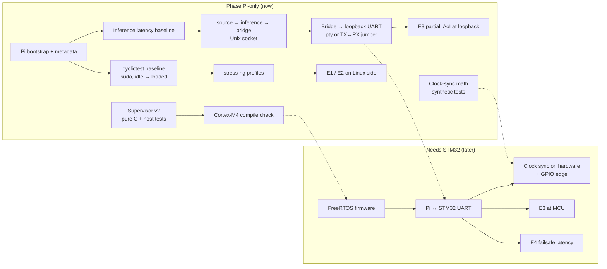
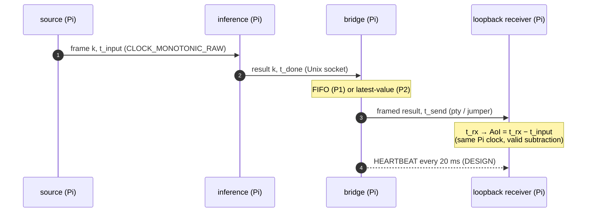
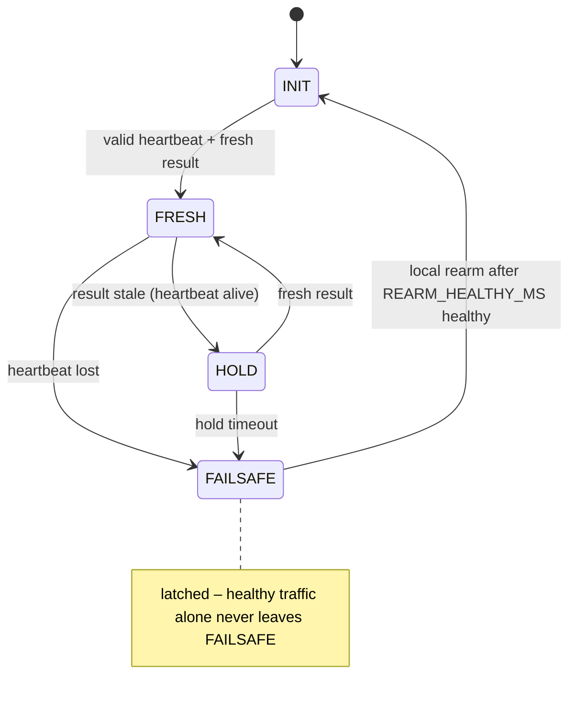
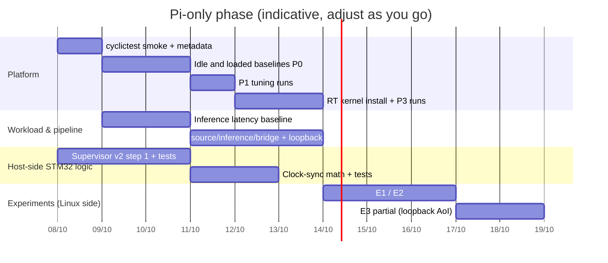

# 2026-10-08 · Phase Pi-only (no STM32 yet)

> [!abstract] Goal of this phase
> Build and measure everything that runs on the **Raspberry Pi 5 alone**, plus the **pure-C STM32
> logic tested on the host**, so that when the Nucleo arrives only the firmware glue and the
> physical link remain.

> [!warning] Evidence rule
> Nothing has been measured on hardware yet. Every number gets a label:
> `MEASURED` / `CALCULATED` / `DESIGN` / `SOURCE` / `ASSUMED`. A smoke test is not a baseline.

---

## 1. What is in scope now vs later

| Item | Pi-only phase (now) | Needs STM32 (later) |
|---|:---:|:---:|
| Pi bootstrap, metadata logging | ✅ | |
| `cyclictest` timing baseline (P0, then P1, P3) | ✅ | |
| Inference latency baseline (MobileNetV2 / ONNX Runtime) | ✅ | |
| stress-ng contention profiles (CPU, memory bandwidth, cache, I/O) | ✅ | |
| source → inference → bridge pipeline (Unix socket) | ✅ | |
| Bridge writes frames to a **loopback / pseudo-terminal** UART | ✅ | |
| E1 contention, E2 tuning/RT kernel (Linux-side latency) | ✅ | |
| E3 freshness P1 vs P2, AoI measured **at the bridge/loopback receiver** | ✅ (partial) | AoI at the MCU |
| Supervisor v2 (pure C) + host tests + Cortex-M4 compile check | ✅ | run on Nucleo |
| Clock-sync math (T1–T4) with synthetic clocks | ✅ | real exchange + GPIO edge |
| FreeRTOS firmware (UART RX, supervisor, status, failsafe pin) | | ✅ |
| Pi ↔ STM32 UART link, error counts | | ✅ |
| E4 fault injection, failsafe latency (logic analyzer) | | ✅ |

---

## 2. Today's log

> [!success] Done today
> - Slides: final deck approved (`a023349`, 45 pages); playbook `slides/SLIDE_PLAYBOOK.md`.
> - Prompts for the AI team: `prompts/CHATGPT_WORK_LEAD.md`, `prompts/academic-beamer-deck/SKILL.md`.
> - Readiness report + supervisor v2 contract proposal written by Codex (outputs folder).

> [!failure] cyclictest smoke test failed (expected)
> `cyclictest` asked for scheduling privileges → needs `sudo` (CAP_SYS_NICE + CAP_IPC_LOCK) and
> must run **on the Pi**, not on the Mac. Command, error, exit code and metadata were saved; no
> latency result accepted. ✔ correct handling.

> [!question] Decisions taken on the supervisor v2 proposal
> Approved with: (a) two steps — step 1 timers/latch/rearm/sequence, step 2 source-AoI mapping;
> (b) age without clock sync = `pi_age_at_send + (now_MCU − rx_MCU) + UART_BOUND` (no cross-clock
> subtraction); (c) one global uint16 wire sequence; (d) local rearm after `REARM_HEALTHY_MS`
> (default 500 ms, DESIGN); (e) time regression → reject + count, no FAILSAFE; (f) thresholds in a
> config struct; (g) host test target + CI job + Cortex-M4 compile-only; (h) new branch
> `feat/supervisor-v2`, reuse `hea_proto`; (i) full report.
> ❓ Open: does the INFERENCE payload already carry `t_input` / age? If not, a payload field
> needs owner approval.

---

## 3. Task board (Pi-only phase)

### 3.1 Platform & timing
- [ ] Re-run the cyclictest smoke test on the Pi with sudo
  `sudo cyclictest --mlockall --priority=80 --interval=1000 --distance=0 --threads=4 --affinity --duration=60 --quiet`
- [ ] Record metadata with every run: `uname -r`, CPU governor, `vcgencmd measure_temp`,
      `vcgencmd get_throttled`, cooler state, date/commit
- [ ] Idle baseline P0 (longer run, e.g. 10 min) → label `MEASURED (idle)`
- [ ] Loaded baseline P0 with stress-ng CPU / memory-bandwidth / cache profiles
- [ ] P1 (SCHED_FIFO 50, pinning, cgroups, mlockall) – same runs
- [ ] P3: install packaged Real-time Ubuntu kernel (`pro enable realtime-kernel --variant=raspi`), same runs

### 3.2 Workload
- [ ] ONNX Runtime + MobileNetV2 installed; fixed model, input, threads
- [ ] Inference latency baseline: cold start, preprocessing and inference measured separately;
      keep all samples; P50/P95/P99/max → sets the source period and HOLD/FAILSAFE thresholds

### 3.3 Linux pipeline
- [ ] `source` (100 ms period, `CLOCK_MONOTONIC_RAW`, `clock_nanosleep` absolute)
- [ ] `inference` process, Unix domain socket to `bridge`
- [ ] `bridge`: FIFO vs latest-value buffer (P1 vs P2), heartbeat 20 ms (DESIGN), frames via `hea_proto`
- [ ] UART stand-in: pseudo-terminal pair (`socat`) or GPIO14↔GPIO15 jumper loopback on the Pi
- [ ] Logger: CSV per run with timestamps `t_input`, `t_done`, `t_send`, `t_rx_loopback`

### 3.4 Host-side STM32 logic (no board needed)
- [ ] Supervisor v2 step 1 on `feat/supervisor-v2` + acceptance matrix tests
- [ ] Cortex-M4 compile-only check (`arm-none-eabi-gcc -mcpu=cortex-m4 -mthumb -Wall -Wextra -Werror`)
- [ ] Clock-sync math (offset/delay from T1–T4, drift fit, min-delay filter) with synthetic clocks

### 3.5 Experiments possible now
- [ ] E1: P0 idle vs each stressor – end-to-end latency to the loopback receiver
- [ ] E2: P0 vs P1, P1 vs P3 – same metrics + dispatch jitter
- [ ] E3 (partial): P1 vs P2 at rising load – AoI at the loopback receiver

---

## 4. Data path in this phase

> [!tip] Why loopback is still meaningful
> Linux-side delay (scheduling, contention, buffering) is what E1–E3 study. With sender and
> receiver on the same Pi clock, latency and AoI are valid without clock sync. What it cannot
> show: MCU-side delay and failsafe reaction → those wait for the STM32.

---

## 5. Supervisor v2 (step 1) – target behaviour

| Event | Effect | Test |
|---|---|---|
| Duplicate / old / ambiguous wire seq | rejected, no timer refresh | ✅ required |
| New header, duplicate `input_seq` | heartbeat-like only, result timer not refreshed | ✅ |
| Timeout and arrival at same instant | timeout evaluated first | ✅ |
| Time regression | reject + error counter | ✅ |
| CRC error (via `hea_parser_feed`) | dropped, no refresh | ✅ |
| Premature rearm | refused | ✅ |

---

## 6. Plan

---

## 7. Open questions / decisions

- [ ] Does INFERENCE carry `t_input` or age-at-send? (affects supervisor freshness)
- [ ] UART stand-in: `socat` pty pair or physical GPIO14↔15 jumper? (jumper exercises the real PL011 driver)
- [ ] Which Pi UART device (`/dev/ttyAMA0` on GPIO14/15) and baud (921600 DESIGN)?
- [ ] Stressor parameters per R5 (`--stream`, `--cache` sizes, `--memrate`)
- [ ] Run length and repetitions per configuration; exclusion rule for throttled runs

## 8. Links

- Repo notes: `docs/SYSTEM_GUIDE.md` · `docs/ROADMAP.md` · `docs/research/R3.md` (Pi 5 timing) · `docs/research/R5.md` (stressors)
- Agent prompts: `prompts/CHATGPT_WORK_LEAD.md`
- Learning: `docs/LEARNING_PLAN.md` (modules 0–2 match this phase: OS model, scheduling, timers)
